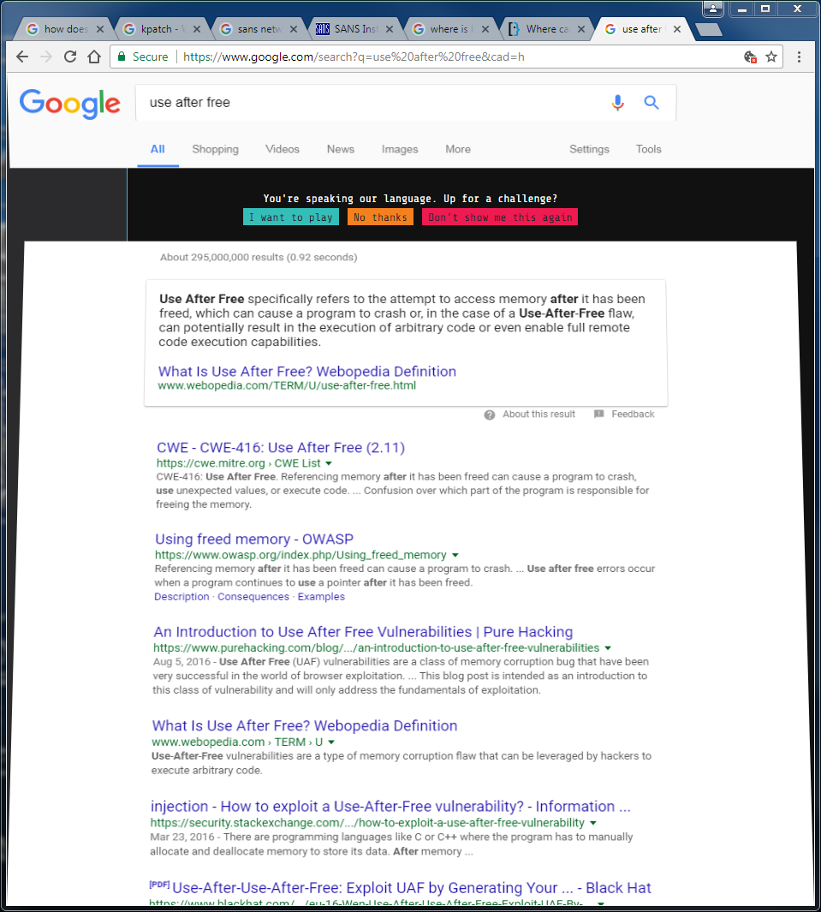
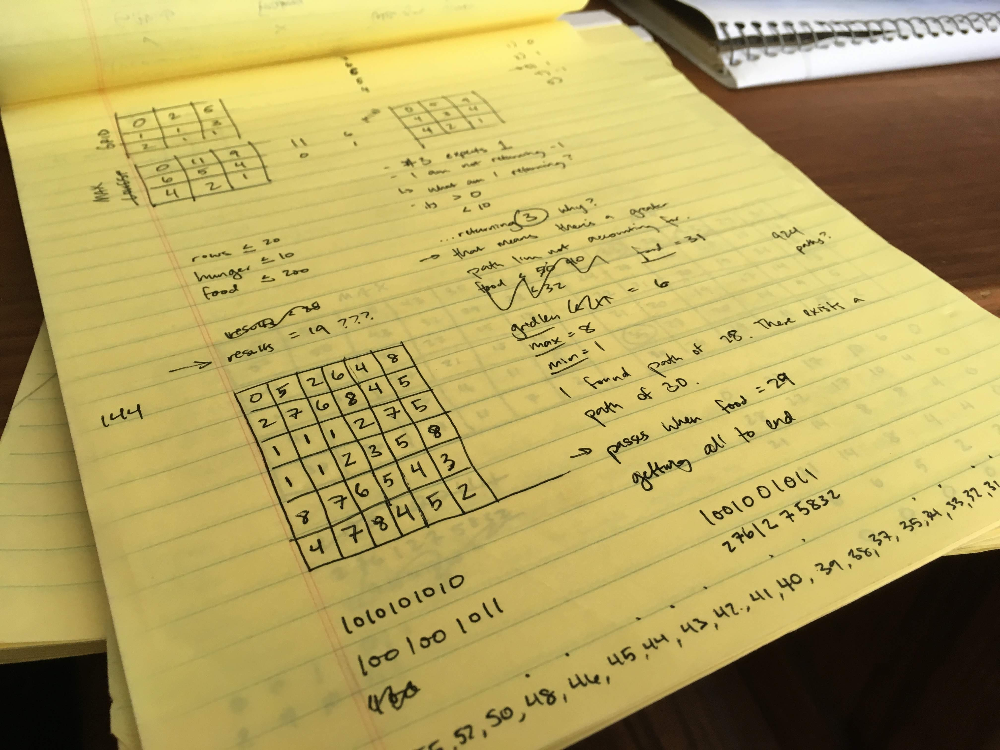
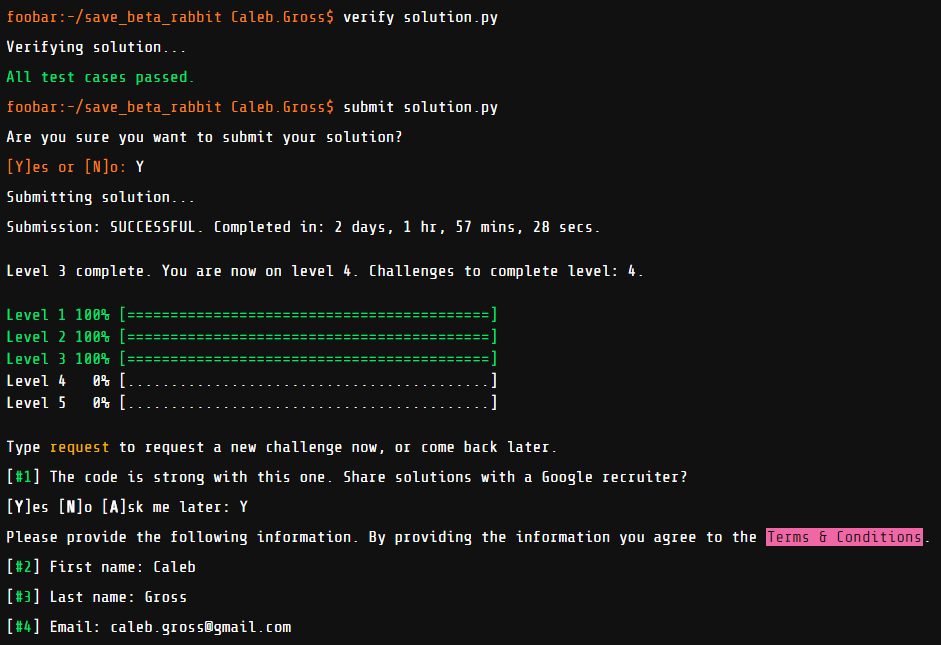

## Disclaimer
I'm uploading my solutions for educational purposes only. If you're referencing this as you try to complete the challenge yourself, that's a poor choice&mdash;you should consider attempting this challenge honestly to get the best experience out of it.

# Google foo.bar

foo.bar is a secret web tool used by Google to recruit new employees based on what they search for online. You can read more about the challenge on [IBTimes](https://www.ibtimes.co.uk/google-foobar-how-searching-web-earned-software-graduate-job-google-1517284), [Medium](https://medium.com/@avery_1242/my-experience-with-google-foobar-tips-for-tackling-googles-legendary-coding-challenge-dbc20a054e4e), and [Quora](https://www.quora.com/What-is-Google%E2%80%99s-Foobar). I've triggered the prompt twice by searching for `python list comprehension` and `use after free`. Each time, the page split open to reveal the message, "You're speaking our language. Up for a challenge?"

The challenges increase in difficulty and allotted time (ranging from a day to a few weeks) with each level. Your code is run against hidden test cases which test both its execution speed and its memory efficiency. In my experience, a higher level also meant that the problem required more knowledge of common algorithms in order to solve them. I worked on foo.bar over the course of a month while juggling other coursework for my job.

After completing three levels, I was prompted to share my contact information with a Google recruiter. I waited a few weeks&mdash;I assume my solutions were being reviewed during this time&mdash;before I received an email from a Google recruiter saying, "I'm genuinely interested in learning more about your current situation and where you envision your career trajectory long-term."

